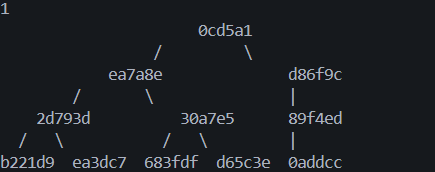
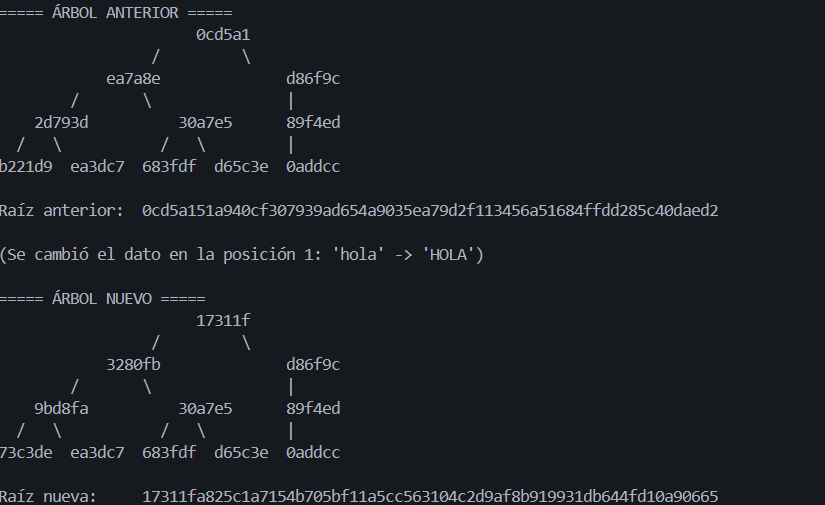
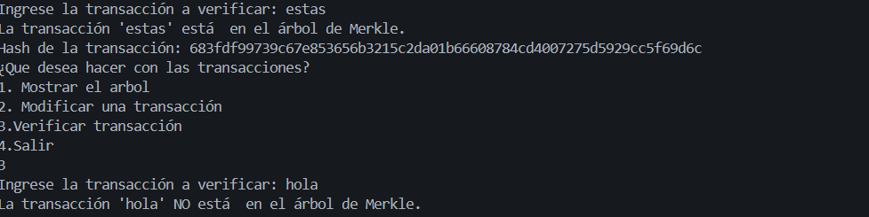

# Laboratorio 2 – Árbol de Merkle

### Codigo realizado con la ayuda de [ClaudeAI](https://claude.ai)

**Estudiante:** Simon Montoya

## Objetivo

Implementar un **árbol de Merkle** utilizando funciones hash SHA-256 para almacenar y verificar transacciones. 
## Funcionamiento

Cada transacción es convertida en un hash mediante **SHA-256**. Los hashes se agrupan de dos en dos y se concatenan para generar nuevos hashes, repitiendo el proceso hasta obtener una única raíz de Merkle.

Si un nivel tiene una cantidad impar de hashes, el último hash se utiliza nuevamente para formar su pareja.

## Funciones

### `hash_data(data)`

Convierte un dato en un hash utilizando el algoritmo **SHA-256** y devuelve el resultado en formato hexadecimal.

### `concatenar(n, m)`

Concatena dos hashes y utiliza `hash_data()` para generar un nuevo hash a partir de ellos.

### `raiz_merkle(data)`

Construye el árbol de Merkle a partir de las transacciones. Genera los hashes de las hojas y posteriormente los diferentes niveles hasta obtener la raíz.

La función devuelve:

* La raíz del árbol.
* Todos los niveles del árbol para poder visualizarlo posteriormente.

### `mostrar_arbol(niveles, largo=6)`

Muestra visualmente el árbol de Merkle en la consola, utilizando una representación de los primeros caracteres de cada hash y conectando los nodos mediante líneas.

Esta función fue desarrollada **con ayuda de Inteligencia Artificial (IA)- Claude AI** para facilitar la representación gráfica del árbol en la consola.

### `modificar_transaccion(datos, niveles_anteriores, pos, nuevo_valor)`

Modifica una transacción, vuelve a calcular el árbol y muestra la diferencia entre el árbol y la raíz anteriores y los nuevos.

### `verficar_transacciones(datos, verificar)`

Comprueba si una transacción ingresada se encuentra dentro de los datos utilizados para construir el árbol. Si existe, muestra su hash.

## Ejecución

Al ejecutar el programa, se solicita la cantidad de transacciones y posteriormente cada uno de los datos.

Después se presenta un menú con las siguientes opciones:

1. Mostrar el árbol
2. Modificar una transacción
3. Verificar transacción
4. Salir

## Pruebas

